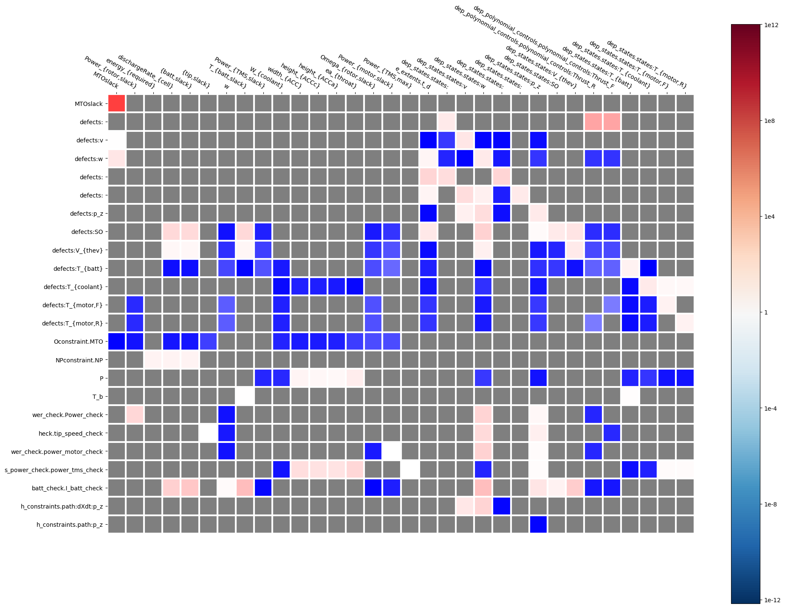

POEM ID: 032  
Title: Detailed Driver Scaling Report  
authors: [justinsgray]    
Competing POEMs: N/A   
Related POEMs: N/A  
Associated implementation PR:  

Status:  

- [ ] Active  
- [ ] Requesting decision  
- [x] Accepted  
- [ ] Rejected  
- [ ] Integrated  


Motivation
----------
Getting scaling right on a large optimziation is challenging, 
even when you have a good sense of the problem. 
Most users --- especially ones who are debugging other peoples opts ---
don't have a complete picture of all the DVs, objectives, and constraints. 

The framework should be able to produce a report showing the model values and the scaled values (i.e. as the drive sees them) for all DVs, objectives, constraints. 


Description
-----------

This new feature should be accessible both from a method the user can call on driver, 
or via the OpenMDAO command line. 

Because the scaling report will include information about the objective, constraints, 
and potentially derivatives the model will need to be run. 
So the driver method will have to call run_driver once. 
This call to run_driver should not trigger any case recording (this might be challenging...)


Consider a problem with 15 design variables, 10 constraints, and one objective. 
Users have provided values for ref, ref0, upper and lower (for dvs) for some or all of these.
We need to give the user a detailed summary of the problem scaling. 
Keeping in mind that some or all of the dvs, objectives, 
and constraints might be scalar or arrays. 


The scaling report should be formatted like this: 

```
Design Variables
-----------------

                model  driver                 model driver    model  driver 
 name (shape) | value  (value) | ref | ref0 | lower (lower) | upper (upper) | 
----------------------------------------------------------------------------
x (1)           10      (1)      10     N/A     -20   (-0.2)   100    (10)    
y (10)         |31.6|   (|31.6|)  1     N/A     -100  (-100)   100    (100)    

```

Notes: 

- Array values should be shown as the 2-norm of the array
- Its likely that  the value will be an array, but the ref/ref0 or upper/lower will be scalar. 
  only the array values should be shown as a norm. 
- There will be an option for print-arrays, in which case arrays are flattened and expanded vertically. 
  even though the variable is flattened to show, the shape note should contain the correct shape 
- There will be an option to print the min/max values for arrays (rather than show the full array). 
  The associated ref/ref0 upper/lower will match up with the index of the min/max
- There will be separate sections for design variables, objectives, constraints. 
- The constraint section will add a column idenifying the type (upper/lower/equal). 
  It will also have columns for the current value, along with the constraint value shown in both model and driver scaled values. 
- If a constraint is specified with both lower and upper, then separate rows will output for each argument. 
- At the start of each section should be a summary table which gives the minimum and maximum value based on driver scaled quantities. 


The format when arrays are fully expanded will look like this
```
Design Variables
-----------------

                model  driver                 model driver    model  driver 
 name (size)  | value  (value) | ref | ref0 | lower (lower) | upper (upper) | 
----------------------------------------------------------------------------
x (1)           10      (1)      10     N/A     -20   (-0.2)   100    (10)    
y (10)          10      (10)      1     N/A     -100  (-100)   100    (100)    
                10      (10)      1     N/A     -100  (-100)   100    (100)    
                10      (10)      1     N/A     -100  (-100)   100    (100)    
                10      (10)      1     N/A     -100  (-100)   100    (100)    
                10      (10)      1     N/A     -100  (-100)   100    (100)    
                10      (10)      1     N/A     -100  (-100)   100    (100)    
                10      (10)      1     N/A     -100  (-100)   100    (100)    
                10      (10)      1     N/A     -100  (-100)   100    (100)    
                10      (10)      1     N/A     -100  (-100)   100    (100)    
                10      (10)      1     N/A     -100  (-100)   100    (100)    

```


The format when arrays are shown as min/max
```
Design Variables
-----------------

                model  driver                 model driver    model  driver 
 name (size)  | value  (value) | ref | ref0 | lower (lower) | upper (upper) | 
----------------------------------------------------------------------------
x (1)           10      (1)      10     N/A     -20   (-0.2)   100    (10)    
y (10)         |31.6|   (|31.6|)  1     N/A     -100  (-100)   100    (100)    
  min           10      (10)      1     N/A     -100  (-100)   100    (100)    
  max           1000    (100)     1     N/A     -100  (-100)   100    (100)    
```


In addition to the display of the values, there will be an option to display derivative information (the jacobian)
in an graphical interface.
The usefulness of being able to visually inspect the jacobian is that it allows the user to connect scaling and initial
conditions directly to the resulting jacobian. As the user scales a control value, this affects the whole column of the
jacobian. As the user scales a constraint, this affects a whole row of the jacobian. Thus if the user is successful in
normalizing a single element of the jacobian matrix, that may cause other elements in that row or column to change unexpectidly. 
Additionally, this matrix can allow users to understand and explore the relationship between defect_ref on states and the resulting
effects on the jacobian matrix. 

The derivative section will be formatted as follows: 



**The Matrix:**
The jacobian will be displayed as a matrix heat graph where the controls and states are shown in the colums
and the constraints are listed in the rows. The individual cells represent the derivative of the column element
with respect to the row element. The colors in each cell represent how large or small the abs(norm(Jacobian)) 
for that particular derivative. The absolute value should be used because it does not matter if the values
are negative or positive, it only matters if the values are large (1e12) or small (1e-12). 
Mousing over any individual item in the matrix should display the norm of the jacobian for that derivative. 
The names displayed along the rows and columns should be selectable either absolute or promoted names with the same
default naming as the html XDSM visualisation. 

**Color Bar:**
The color elements on the left color bar should follow the following scheme:
Dark blue is used for for small numbers (1e-12),
White should always be for normalized jacobian values close to 1. Because this is the normalized value, it is 
the only good reference value. 
Dark red should be for jacobian values that are very large (1e12) 
Grey is reserved for elements that are blank/ non corellated. These are based on the coloring of the problem.
It is important that the maximum extents of the color bar should not be black, because that will prevent us from
seeing the difference between very large numbers and very small numbers.
It may be useful to allow the user to select the maximum extents of the coloring. 
Thresholding should be implmented so very large and very small values stay on the color bar (they are capped to 
1e12 or 1e-12 unless the color bar is expanded by the user). This is the case in Jacobian_0.png where there existed
lower values as small as 1e-38. 

